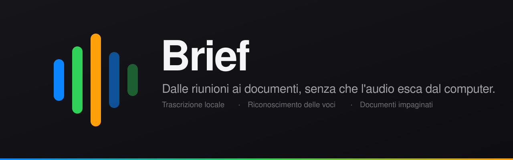

<div align="center">



<br>

[](https://github.com/Gecky2102/Brief/releases/latest)
[](https://github.com/Gecky2102/Brief/releases)
[](https://github.com/Gecky2102/Brief/releases/latest)
[](https://github.com/Gecky2102/Brief/releases/latest)
[](https://github.com/Gecky2102/Brief/actions)

[Scarica](#installazione) · [Come funziona](#come-funziona) · [Privacy](#dove-finiscono-i-dati) · [Sviluppo](#sviluppo)

</div>

---

Brief ascolta una riunione, capisce chi sta parlando e ne ricava un documento
di lavoro: non un riassunto di tre righe, ma un resoconto che una persona
assente può leggere al posto di aver partecipato.

## Come funziona

### Registra due tracce separate

Microfono e audio di sistema vengono catturati distintamente — su macOS con
ScreenCaptureKit, su Windows con il loopback di WASAPI. Nessun driver da
installare, nessun dispositivo virtuale da configurare.

### Riconosce chi parla

Un modello di impronta vocale raggruppa gli interventi per persona. Dai un nome
a ogni voce, uniscine due quando il riconoscimento ha diviso la stessa persona,
sposta un singolo intervento sulla voce giusta. I nomi finiscono nel documento,
così le decisioni vengono attribuite a chi le ha prese.

### Trascrive mentre parli

whisper.cpp con accelerazione GPU su Mac. Ogni finestra riceve il contesto
della precedente, e un vocabolario personale — nomi di clienti, colleghi,
sistemi — evita che vengano storpiati.

### Scrive un documento, non un riassunto

Da 600 a 6000 parole, con otto tagli diversi:

| | |
|---|---|
| **Riunione** | temi, decisioni, attività, rischi |
| **Sintesi direzionale** | l'essenziale in cima, il dettaglio in fondo |
| **Verbale** | ordine del giorno, svolgimento, deliberazioni |
| **Lezione** | concetti, definizioni, esempi svolti |
| **Intervista** | temi, citazioni testuali, fatti e cifre |
| **Punto di avanzamento** | per persona: fatto, in corso, impedimenti |
| **Brainstorming** | idee, pro e contro, direzioni promettenti |
| **Automatico** | riconosce da sé di che tipo di conversazione si tratta |

### Archivia e ritrova

Ricerca full-text che mostra il punto esatto in cui compare un termine, e
ricerca **per significato**: «ritardi dei fornitori» trova anche chi diceva
«non arrivano in tempo». Cartelle per separare clienti e progetti.

### Riascolta mentre leggi

Clicca il minutaggio di una riga e senti quel punto della registrazione, con
velocità regolabile. Utile per verificare una parola dubbia — e correggerla:
la trascrizione è modificabile riga per riga.

## Installazione

Scarica dalla [pagina delle release](https://github.com/Gecky2102/Brief/releases/latest):

- **macOS** — `Brief_x.y.z_aarch64.dmg`, trascina nella cartella Applicazioni
- **Windows** — `Brief_x.y.z_x64-setup.exe`

Gli aggiornamenti successivi arrivano dall'app stessa: ti avvisa, ti dice quale
versione, e li installa solo se lo chiedi.

> [!NOTE]
> Al primo avvio il sistema chiede il **microfono** e la **registrazione
> schermo** — quest'ultima è il permesso che serve per catturare l'audio di
> sistema, non per fare schermate. Su macOS, dopo averla concessa, l'app va
> riavviata: lo impone il sistema operativo.

> [!IMPORTANT]
> L'app non è firmata con un certificato Apple. Al primo avvio macOS potrebbe
> bloccarla: click destro sull'icona › **Apri**, poi conferma.

### Requisiti

| | |
|---|---|
| **macOS** | 13 Ventura o successivo, Apple Silicon |
| **Windows** | 10 o successivo, 64 bit |

Su Mac Intel non è disponibile: il motore di riconoscimento voci non fornisce
più binari per quell'architettura. Su Windows la trascrizione gira su
processore anziché su GPU, quindi è più lenta.

## Dove finiscono i dati

Tutto in locale:

```
macOS    ~/Library/Application Support/it.gmasiero.brief/
Windows  %APPDATA%\it.gmasiero.brief\
```

Database delle sessioni, registrazioni in AAC, modelli scaricati e la chiave
del servizio di analisi, in un file leggibile solo dal tuo utente.

**L'unica cosa che esce dal computer è il testo della trascrizione**, inviato
al servizio che scegli per scrivere il documento. Mai l'audio. Puoi anche
escludere singole righe dal documento senza cancellarle.

Servizi supportati: **Anthropic**, **OpenAI**, **Google**, **OpenRouter** o
qualsiasi servizio compatibile con l'interfaccia di OpenAI, incluso un gateway
tuo.

## Modelli

Scaricati al primo uso e verificati contro l'hash SHA-256 pubblicato: un file
troncato o manomesso viene scartato. I download interrotti riprendono da dove
erano rimasti.

| | File | Peso |
|---|---|---|
| Trascrizione accurata | `ggml-large-v3-turbo-q5_0.bin` | 574 MB |
| Trascrizione veloce | `ggml-small-q5_1.bin` | 190 MB |
| Riconoscimento voci | `wespeaker-resnet34.onnx` | 27 MB |
| Ricerca per significato | `multilingual-e5-small.onnx` | 113 MB |

## Scorciatoie

| | |
|---|---|
| <kbd>Spazio</kbd> | Avvia o ferma la registrazione |
| <kbd>⌘N</kbd> | Nuova sessione |
| <kbd>⌘F</kbd> | Cerca |
| <kbd>⌘R</kbd> | Genera o rigenera il documento |
| <kbd>⌘P</kbd> | Esporta in PDF |
| <kbd>⌘⇧C</kbd> | Copia negli appunti |
| <kbd>⌘,</kbd> | Impostazioni |
| <kbd>?</kbd> | Elenco delle scorciatoie |

## Com'è fatto

| Livello | Scelta |
|---|---|
| Interfaccia | React, TypeScript, Tailwind |
| Applicazione | Tauri v2 (Rust) |
| Cattura audio | ScreenCaptureKit e AVFoundation (Swift) · cpal e WASAPI (Windows) |
| Trascrizione | whisper.cpp, Metal su Apple Silicon |
| Voci e ricerca | ONNX Runtime |
| Dati | SQLite con FTS5 |
| Documenti | provider online configurabile |

Trascrizione, riconoscimento voci e ricerca girano **in locale**. Solo la
scrittura del documento usa un servizio esterno.

## Sviluppo

```bash
npm install
npm run tauri dev      # sviluppo
npm run tauri build    # genera i pacchetti
cargo test             # test unitari
```

Serve la toolchain Rust, `cmake` per whisper.cpp e, su macOS, gli Xcode
Command Line Tools.

### Pubblicare una versione

```bash
git tag v0.3.0 && git push --tags
```

La compilazione parte da sola su macOS e Windows, firma i pacchetti e pubblica
la release. Richiede il segreto `TAURI_SIGNING_PRIVATE_KEY` nel repository.

## Contribuire

Segnalazioni e proposte sono benvenute nelle
[issue](https://github.com/Gecky2102/Brief/issues). Per una modifica al codice,
apri prima una issue per discuterne: è un progetto personale e preferisco
allinearci prima che tu spenda tempo.

I messaggi di commit seguono i [Conventional
Commits](https://www.conventionalcommits.org/it/), in italiano.

## Licenza

[MIT](LICENSE) © Giacomo Masiero
